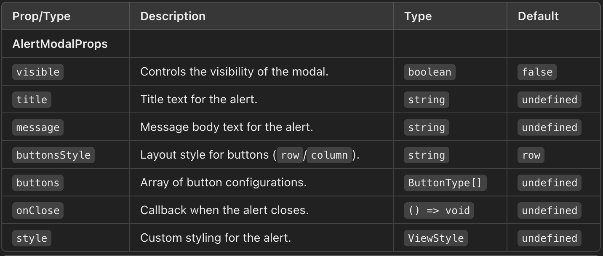
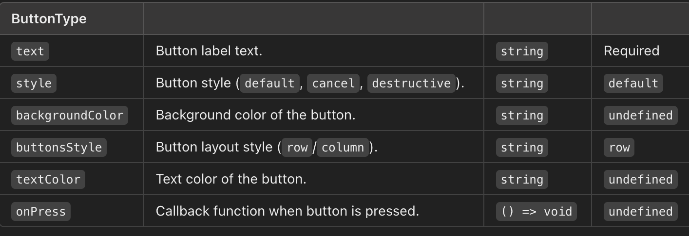
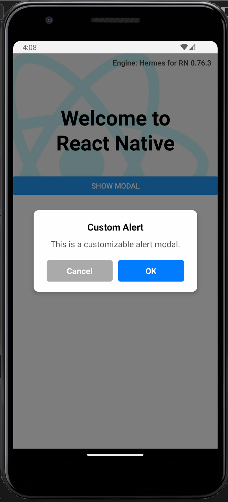
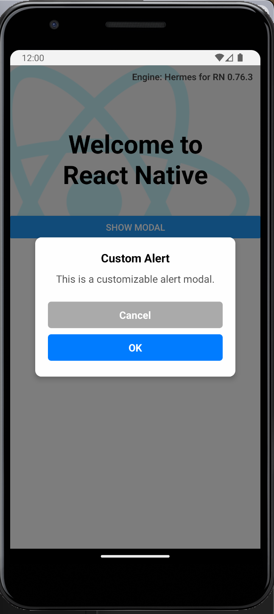

# react-native-custom-alert-modal

A simple and customizable modal for React Native that functions like the default alert but with enhanced styling and functionality.

## Installation

Install the package using npm or yarn:

npm install react-native-custom-alert-modal
or
yarn add react-native-custom-alert-modal

## Usage

    import AlertModal from 'react-native-custom-alert-modal';

    const [modalVisible, setModalVisible] = useState(false);

    const buttons: Array<ButtonType> = [
    {
      text: 'OK',
      backgroundColor: 'green',
      textColor: '#FFFFFF',
      style: 'default',
      onPress: () => console.log('OK Pressed'),
    },
    {
      text: 'Cancel',
      backgroundColor: 'silver',
      textColor: '#000000',
      style: 'cancel',
      onPress: () => console.log('Cancel Pressed'),
    },

  ];

    return (
        <View style={{ flex: 1, justifyContent: 'center', alignItems: 'center' }}>
            <Button title="Show Modal" onPress={() => setModalVisible(true)} />
            <AlertModal
                visible={modalVisible}
                title="Custom Alert"
                buttonsStyle="column"
                message="This is a customizable alert modal."
                buttons={buttons}
                onClose={() => setModalVisible(false)}
            />
        </View>
    );

## Props

## Button Object Format (ButtonType)

## Android View

## Customization
You can style the modal and its components by modifying the StyleSheet in the source code.
Buttons can have different styles (default, cancel, destructive) for visual cues.

## Contributing
Contributions, issues, and feature requests are welcome!
Feel free to check the issues page.

## License
This project is licensed under the MIT License. See the LICENSE file for details.